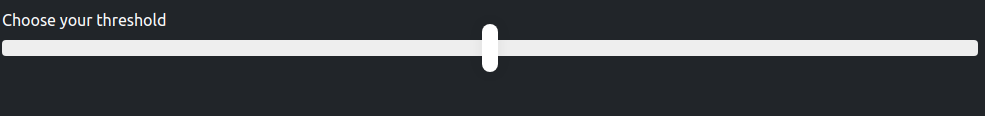

# This is too loud app
A simple app that warns you when you are too loud. Just set what is an acceptable noise level and what is not. 
If you exceed the average between target and unacceptable noise level you are being warned.

### Architecture
My first electron app. Standard electron app with little extras. Use `npm start` to run it.
## What it looks like

## How to get it
[Get an installer](https://github.com/axel1200/this-is-too-loud/releases)
[See online](https://axel1200.github.io/this-is-too-loud/)
